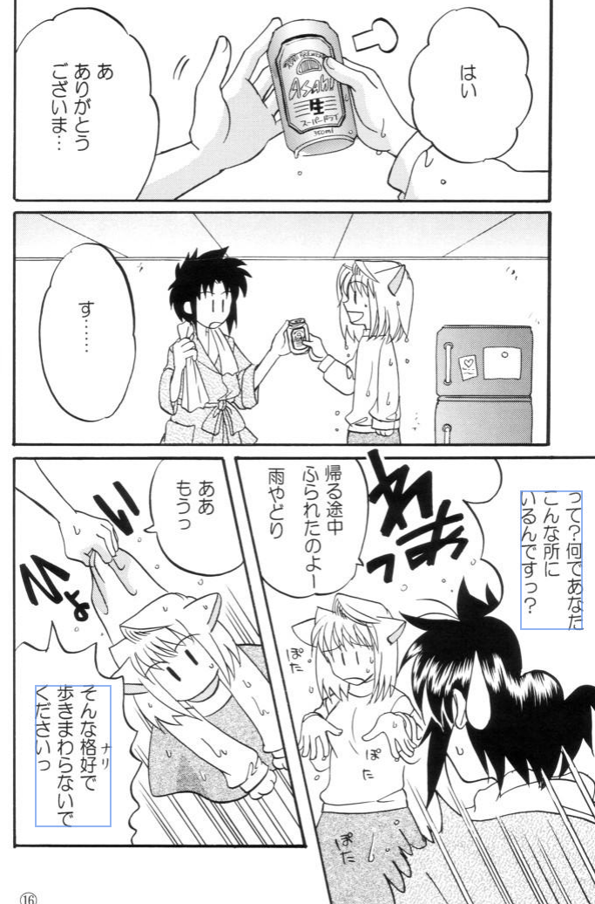

# jpn_vert_traineddata
tesseract jpn_vert traineddata fintune
finetune zodiac3539 jpn_vert model with 16 jp fonts until it reach BCER 1% 
Text transition works well but there is poor text segmentation performance  

# Result   
- input image  
      
- output text comparison

<table>
<tr><td> Ours jpn_vert_new </td> <td> <a href="https://github.com/zodiac3539/jpn_vert">zodiac3539 jpn_ver5</a> </td><td> <a href="https://github.com/NbtKmy/jpn_vert_improvement">NbtKmy jpn_vert_v4</a> </td></tr>
<tr>
<td  style="white-space: pre;">
えっと…
ワァスサナーにかは
前にはないのね

横かしら?
それ上き後ろ?

ちょっと!
ピこ強って
るんですかっ

</td>
<td>
      悶                       ちょっと‼
疾                  旋也⁈
到尼                       かっ‼
o       ボッヅクになってて
加量倫了     系有旋外
92

ワ-スナーたかは
ヮスナーとかは
女路小

かしら?
評い千⁈

</td>
<td> 
                       ちょつとリ
捉                  放っ
にて                       かつり
       ボックになってて
/、湾下     はずれるのね
の4v0全

ファスナーとかは
アスナーとかは
門にはないのね

かしら?
それとも後ろア

</td>
</tr>
</table>
  

# Acknowledgement and References  
- [tesseract-training](https://github.com/nikhilbaby/tesseract-training) 
- [tesseract-custom-font-training](https://github.com/xayilmaz/tesseract-custom-font-training) 
- [tesseract-custom-font-training](https://github.com/tesseract-ocr/tesseract/issues/3001) 
- [Best Practices re OPENMP](https://github.com/tesseract-ocr/tesseract/issues/3744) 
- [Image too small to scale](https://github.com/tesseract-ocr/tesseract/issues/3001) 
- [tesstrain doesnt support vertical languages](https://github.com/tesseract-ocr/tesseract/issues/2989) 
- [tesseract](https://github.com/tesseract-ocr/tesseract) 
- [tesstrain](https://github.com/tesseract-ocr/tesstrain) 
- [tessdoc](https://tesseract-ocr.github.io/tessdoc/) 
- [zodiac3539 jpn_vert](https://github.com/zodiac3539/jpn_vert) 
- [NbtKmy jpn_vert](https://github.com/NbtKmy/jpn_vert_improvement) 
- [freejapanesefont](https://www.freejapanesefont.com/)     
- [google font](https://fonts.google.com/?subset=japanese&noto.script=Jpan)     
- [google font github](https://github.com/google/fonts)     

